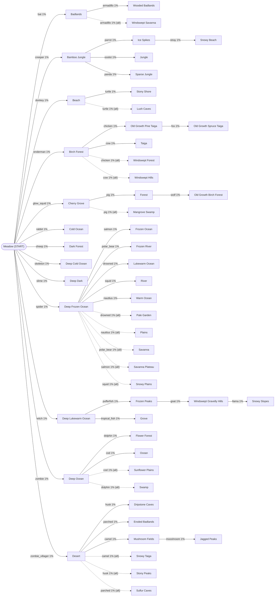

# Biome Stone progression flowchart

Full unlock graph for the [Biome changer](CLAUDE.md#biome-changer-chunk-scale-biome-edit) mob-drop progression — see CLAUDE.md for the design rationale, the 46-distinct-mobs-vs-54-needed constraint that shaped it, and the loot table mechanism. This file is just the diagram, kept separate because it's large.

Solid arrow = the mob's only possible Biome Stone drop. Dashed arrow = one of two possible outcomes, 50/50. Every edge is a 1% chance, `killed_by_player` only.

