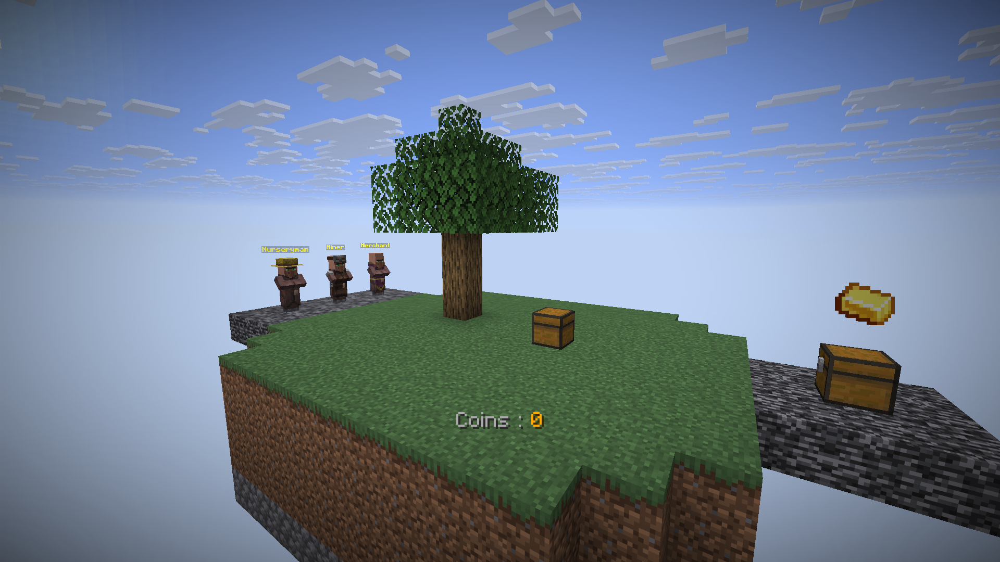
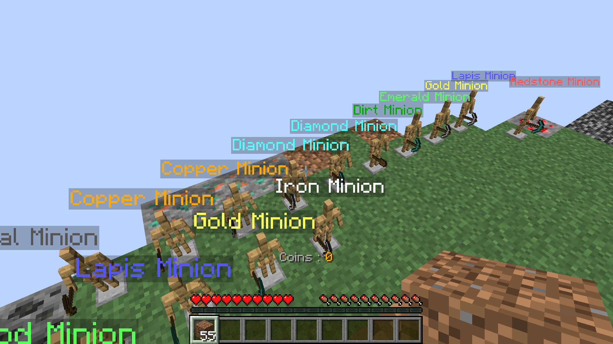
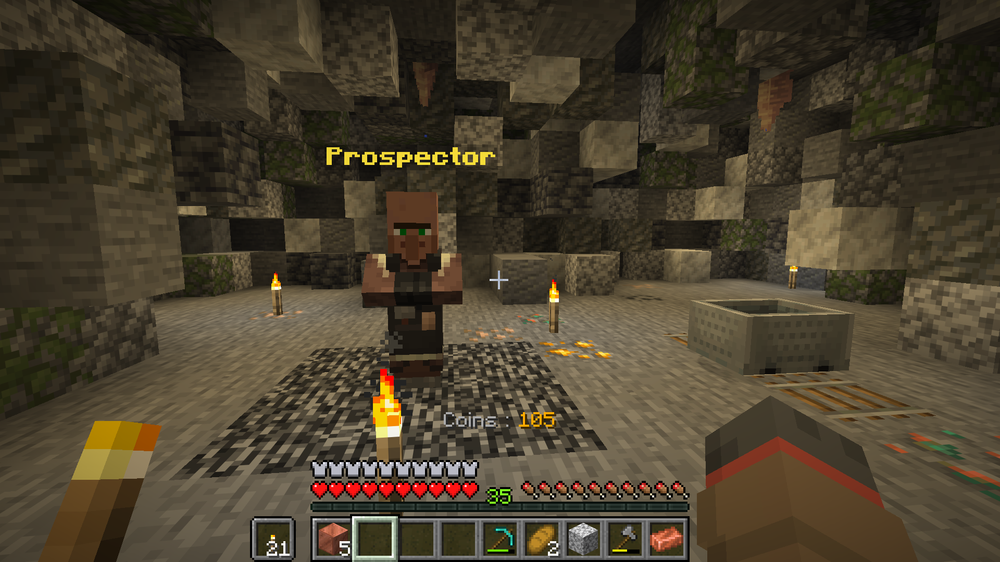

# MinionSkyBlock

**A free, open-source data pack for Minecraft: Java Edition inspired by Hypixel SkyBlock’s gameplay loop — no mods required.**

Start on a tiny island in the void, automate resource gathering with Minions, and build your fortune through a full player-driven economy — solo or with friends on a realm.

> 📦 Repository: **[github.com/YannLeBezvoet/minionSkyBlock](https://github.com/YannLeBezvoet/minionSkyBlock)**

## Why you'll like it

- **Zero install friction** — it's a data pack, not a mod. No Forge/Fabric, no client-side changes for your friends on a realm.
- **Idle progression** — Minions keep working while you're offline, exactly like the SkyBlock formula that made the mode popular.
- **A real economy** — sell what you gather, buy what you need, and watch your coin count grow.
- **Actively maintained** — built and tuned against the latest Minecraft Java release.

## Gameplay loop

Three fundamental pillars:

1. **Isolated island** — you start on a small island in the middle of the void, with no resources around you.
2. **Minions** — placeable, craftable entities that generate blocks/resources autonomously. Each minion can be upgraded to increase its speed or production.
3. **Economy** — a buying and selling system covering all items in the game, powered by a virtual currency (coins).

On top of the core loop, a **Mining Island** (reached by teleport) offers a hand-dug quarry pit where every block cycles between ore, stone, cobblestone and bedrock as you mine it — a hands-on alternative to letting Minions do all the work.

## Getting started

1. Grab the latest copy of this repository (`Code > Download ZIP`, or `git clone https://github.com/YannLeBezvoet/minionSkyBlock`).
2. Copy the contents of the repository into a `minionSkyBlock` folder under your world's `datapacks` folder (`.minecraft/saves/<world>/datapacks/minionSkyBlock`).
3. Load into the world and run `/reload`.
4. Follow the in-game instructions on your starter island, or read **[HowToPlay.md](HowToPlay.md)** for the full guide (Minions, crafting, the economy, and the Mining Island).

## Credits

Made by [YannLeBezvoet](https://github.com/YannLeBezvoet). If you reuse or fork this data pack, please keep a link back to **[github.com/YannLeBezvoet/minionSkyBlock](https://github.com/YannLeBezvoet/minionSkyBlock)** — it's the best way to support the project and help other players find it.
